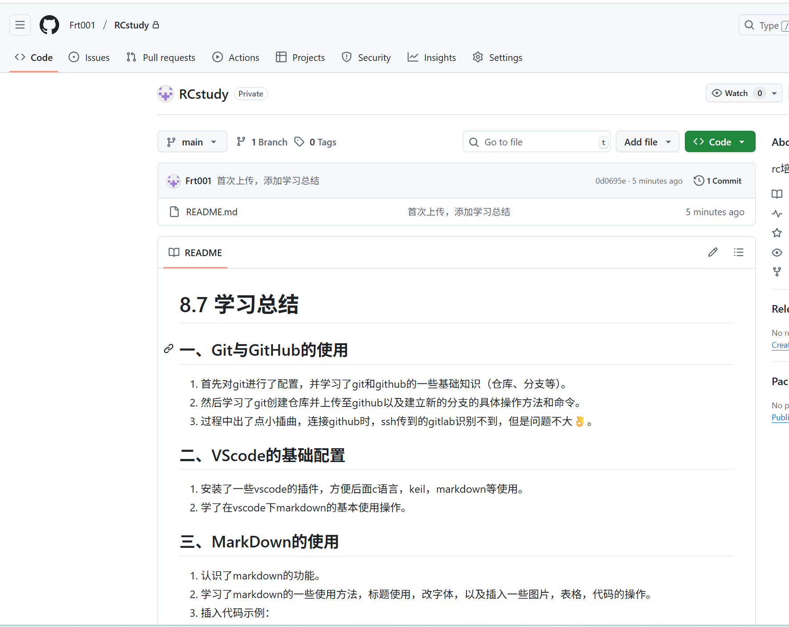

# **8.7 学习总结** 

## 一、Git与GitHub的使用
1. 首先对git进行了配置，并学习了git和github的一些基础知识（仓库、分支等）。
2. 然后学习了git创建仓库并上传至github以及建立新的分支的具体操作方法和命令。
3. 过程中出了点小插曲，连接github时，ssh传到的gitlab识别不到，但是问题不大👌。

## 二、VScode的基础配置
1. 安装了一些vscode的插件，方便后面c语言，keil，markdown等使用。
2. 学了在vscode下markdown的基本使用操作。
   
## 三、MarkDown的使用
1. 认识了markdown的功能。
2. 学习了markdown的一些使用方法，标题使用，改字体，以及插入一些图片，表格，代码的操作。
3. 插入代码示例：
```c
#include <stdio.h>

int main() 
{
    printf("Hello, World!\n");
    return 0;
}
```
4. 插入表格示例：

    | 软件名称       | 是否安装  | 备注|
    |---------------|-----------|----|
    | Git           | ✅       |     |
    | VS Code       | ✅       |     |
    | Keil          | ✅       |已注册|
    | CubeMX        | ✅       |未配置|
    | Dev-c++       | ✅       |     |

## 四、近五天学习成果👾

| 日期 | 所学内容               | 
|------|-----------------------|
| 8.2  | sw零件图的画法和基本操作|
| 8.3  | 机械常用元件的熟悉（电机、传动方式、动力源等）|
| 8.4  | 将原理图转成pcb的画法以及嘉立创查看元件手册|
| 8.5  | 搭建python运行环境，roboflow标注网站，训练yolo|
| 8.6  | 开环闭环结构，一些单片机基础知识，电机整定和Zdrive的使用|

## 五、Git和GitHub运用，成功上传文件

